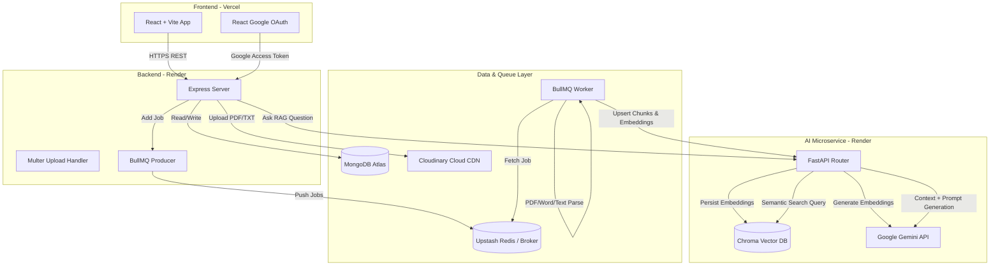

# ORBIT AI — Intelligent Document QA RAG Platform

ORBIT AI is a high-performance, secure, and production-ready Retrieval-Augmented Generation (RAG) platform. It allows users to upload documents (PDF, Word, TXT), manage persistent chat sessions, and query their knowledge base using Google's advanced **Gemini 2.5 Flash** model with ChromaDB vector search.

---

## 1. System Architecture

Below is the decoupled architecture layout of ORBIT AI.



---

## 2. Tech Stack Overview

* **Frontend**: React, Vite, Tailwind CSS, Framer Motion, `@react-oauth/google`
* **API Gateway & Routing**: Node.js, Express, Multer (multipart upload)
* **Databases**: MongoDB Atlas (metadata/chats), ChromaDB (embeddings/vectors)
* **Background Worker / Task Queue**: BullMQ, Redis (Upstash)
* **Cloud Storage CDN**: Cloudinary (permanent PDF/document delivery)
* **AI Service / LLM**: FastAPI, Uvicorn, Google Gemini API (`gemini-2.5-flash`, `text-embedding-004`)

---

## 3. Directory Layout

```text
ORBIT-AI/
├── client/              # React + Vite Frontend
│   ├── src/             # Frontend source code
│   └── package.json     # Frontend dependencies & scripts
├── server/              # Node.js + Express Backend
│   ├── src/             # Backend route controllers, DB connection, queue workers
│   └── package.json     # Backend dependencies & scripts
├── AI/                  # Standalone Python AI service
│   ├── app.py           # FastAPI server endpoints
│   └── requirements.txt # Python dependency file
└── README.md            # Project documentation (this file)
```

---

## 4. Environment Variables Setup

Create the environment files in their respective folders:

### Backend: `server/.env`
```env
PORT=8000
MONGODB_URL=your_mongodb_atlas_connection_string
DATABASE_NAME=orbit_ai
JWT_SECRET_KEY=your_secure_jwt_secret_key
AI_SERVICE_URL=http://localhost:8001
REDIS_URL=redis://localhost:6379 # Or Upstash rediss:// URL
CLOUDINARY_CLOUD_NAME=your_cloudinary_name
CLOUDINARY_API_KEY=your_cloudinary_api_key
CLOUDINARY_API_SECRET=your_cloudinary_api_secret
```

### AI Service: `AI/.env`
```env
GEMINI_API_KEY=your_google_gemini_api_key
CHROMA_PERSIST_DIR=chroma_db
```

### Frontend: `client/.env`
```env
VITE_API_BASE_URL=http://localhost:8000/api/v1
VITE_GOOGLE_CLIENT_ID=your_google_oauth_client_id.apps.googleusercontent.com
```

---

## 5. Local Setup & Running Instructions

Open three terminal windows to run the service stack components concurrently.

### Terminal 1: Run local Redis & Express Server
Make sure you have a local Redis server running (e.g. `brew services start redis` on macOS) on port `6379`, then start the backend:
```bash
cd server
npm install
npm run dev
```

### Terminal 2: Run FastAPI AI Service
Set up a Python virtual environment, install the required packages, and run the service:
```bash
cd AI
python -m venv venv
source venv/bin/activate
pip install -r requirements.txt
uvicorn app:app --port 8001 --reload
```

### Terminal 3: Run React Frontend
```bash
cd client
npm install
npm run dev
```
Open [http://localhost:5173](http://localhost:5173) in your browser to interact with ORBIT AI.
